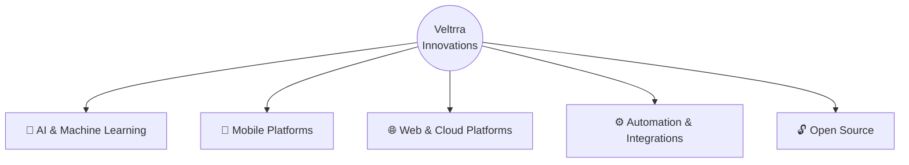

  

<h1 align="center">Veltrra Innovations Labs 🚀</h1>
<h3 align="center"><i>the extra in you</i></h3>

  An innovation ecosystem building intelligent products, platforms, and tools 
  that help people and businesses do more with less.

  <a href="https://veltrra.com">Website</a> ·
  <a href="#-ecosystem">Ecosystem</a> ·
  <a href="#-products">Products</a> ·
  <a href="#-contact">Contact</a>

---

## 🌍 Who We Are

**Veltrra Innovations** is a technology ecosystem that connects **products, research, and community** under one vision: bringing out the extra in every person, team, and organization we work with.

We don't just write software. We design systems, launch products, share our tools with the world, and invest in the next generation of builders.

> **Build. Learn. Scale. Share.**

---

## 🧭 Our Vision

To become a trusted innovation ecosystem that turns bold ideas into technology used by people across industries and borders.

## 🎯 Our Mission

Engineer intelligent, reliable, and accessible technology that creates measurable value for individuals, businesses, and communities.

---

## 🧩 Ecosystem

Veltrra is organized as six connected pillars. Each one feeds the others.

| Pillar | What It Covers |
|---|---|
| 🤖 **AI & ML** | Predictive models, NLP, computer vision, intelligent assistants, MLOps |
| 📱 **Mobile** | Native and cross-platform apps for iOS and Android, from idea to store |
| 🌐 **Web & Cloud** | Scalable web apps, APIs, SaaS platforms, and cloud infrastructure |
| ⚙️ **Automation** | Workflow engines, data pipelines, and third-party integrations |
| 🔓 **Open Source** | Tools, SDKs, and libraries released for the developer community |
| 🎓 **Labs & Academy** | Research prototypes, workshops, and training for emerging builders |

---

## 🏗️ How We Work

- **Problem first.** We start from real user needs, not trends.
- **Engineering with discipline.** Clean architecture, tests, documentation, and security by default.
- **Ship, measure, improve.** Small releases, fast feedback, and continuous iteration.
- **Build in public.** We share our progress, our code, and what we learn.

---

## 🛠️ Technology Stack

---

## 🗺️ Roadmap

- [x] Establish Veltrra Innovations as a company and brand
- [x] Launch first open-source tools
- [ ] Release first AI-powered product
- [ ] Launch mobile app in public beta
- [ ] Start Veltrra Labs for research and prototyping
- [ ] Open a developer academy for training and mentorship

---

## 🤝 Community & Contribution

We welcome contributors, partners, and curious minds.

- ⭐ **Star** our repositories to support our work
- 🐛 **Report issues** and suggest improvements
- 🔧 **Contribute** code through pull requests
- 🤝 **Partner** with us on projects, pilots, or integrations

---

## 📫 Contact

---

  <b>Veltrra Innovations Labs</b> 
  <i>the extra in you</i>

